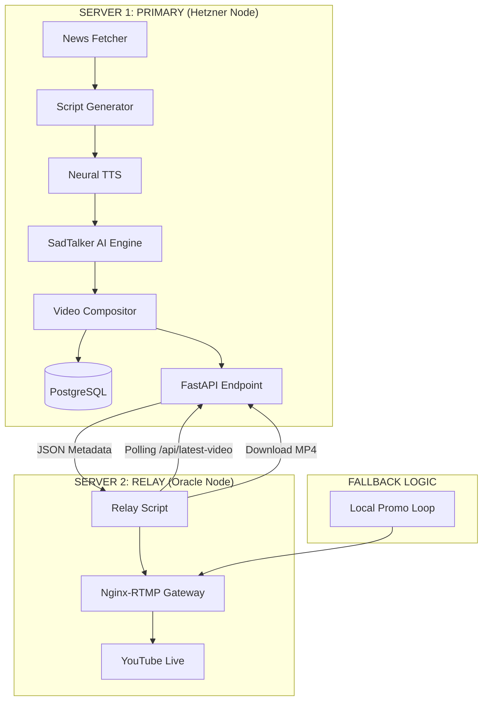

# Varta Pravah - Multi-Node Architecture

The system is designed to run across two specialized cloud nodes to balance AI processing power with streaming stability.

## 1. Primary Node (AI Factory)
- **Role**: This is where the heavy GPU/CPU work happens.
- **Workflow**:
  1. Fetches news from multi-sources.
  2. Generates pure Marathi scripts.
  3. Synthesizes AI anchor video.
  4. Stores results in `/output` and metadata in **PostgreSQL**.
- **Connectivity**: Exposes a public/private API for the relay node.

## 2. Relay Node (Broadcast Station)
- **Role**: Maintains a 24/7 connection to YouTube.
- **Workflow**:
  1. **Poll**: Every 30 seconds, it asks the Primary node: "Is there a new video?"
  2. **Sync**: If yes, it downloads the file to its local storage.
  3. **Stream**: It pushes the file to a local **Nginx-RTMP** server.
  4. **Persist**: Nginx-RTMP keeps the connection to YouTube open even if the relay script is switching files.
- **Fallback**: If the Primary node is down, the Relay automatically switches to an internal `promo.mp4` loop to ensure the YouTube stream never ends.

## 📡 Networking Configuration
- **Server 1**: Must have port `8000` open to Server 2's IP.
- **Server 2**: Must have the `HETZNER_NODE_URL` set to `http://<server-1-ip>:8000` in its `.env` file.

---
This distributed setup ensures that even if you are rendering a heavy AI video on the Primary node, your YouTube stream remains perfectly stable on the Relay node.
